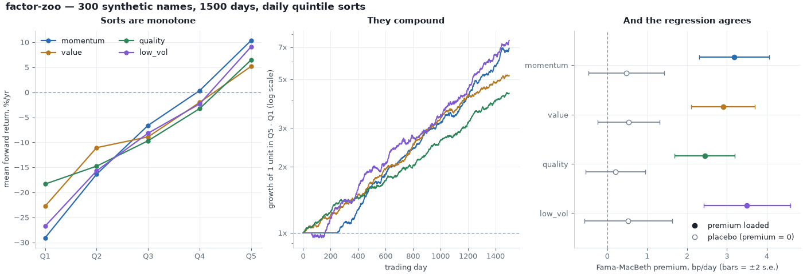
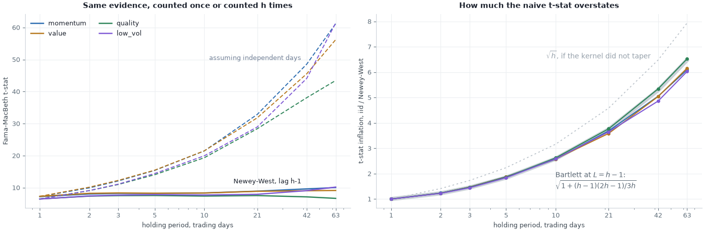
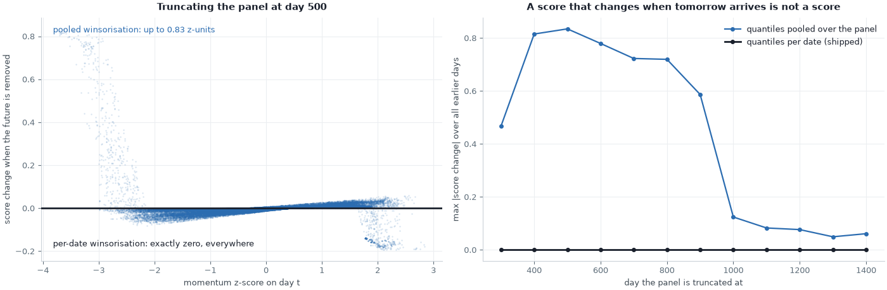
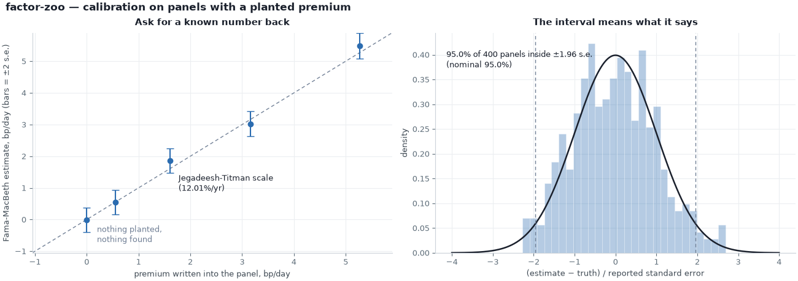

# factor-zoo

[](https://github.com/superkush06/factor-zoo/actions/workflows/ci.yml)
[](https://www.python.org/)
[](LICENSE)

**Cross-sectional equity factors, run on a universe that knows the answer.**

A factor backtest that agrees with you is worth nothing until you can tell
whether it agrees because the signal is real or because the code leaked. So
this library ships its own ground truth. `make_universe` writes known premia
into a synthetic panel, each premium flowing through the characteristic that
is supposed to measure it, and the test suite demands that the pipeline read
those premia back — and read back *nothing* when they are switched off.

Then, because a library that only checks itself agrees with its own
mistakes, [`docs/validation.md`](docs/validation.md) checks the estimators
against sixteen things written elsewhere: the sign of the momentum premium in
Jegadeesh-Titman, of the value premium in Fama-French, of the volatility
effect in Ang et al., and the closed forms for a Gaussian quintile mean, a
bivariate-normal Spearman correlation, a Bartlett long-run variance and the
Shanken correction. One row disagrees, and says why.

What is left over is a small, careful cross-sectional toolkit: daily
portfolio sorts, Fama-MacBeth regressions with Newey-West standard errors,
rank information coefficients. Pure NumPy, stdlib CSV parsing, no pandas.
Point `load_prices_csv` at your own price panel and none of the machinery
changes.



Left: mean forward return by quintile, annualised. Every characteristic's
sort is monotone from Q1 to Q5 — the weakest thing you can ask of a factor
and the first thing that breaks when a pipeline is wired wrong. Middle: the
same Q5 − Q1 spread compounded on a log scale, where a straight line means a
stable Sharpe rather than one lucky year. Right: the Fama-MacBeth premium in
basis points per day, estimated on the universe as generated (filled) and on
a placebo universe with that single premium set to zero (hollow). The placebo
estimates collapse into the noise. That gap is the repository.

## Quickstart

```bash
git clone https://github.com/superkush06/factor-zoo.git
cd factor-zoo
pip install -e ".[dev]"
pytest -q
```

```python
from fz import fama_macbeth, forward_returns, make_universe, momentum, value_btm

u = make_universe(n_stocks=300, n_days=1500, seed=0)
design = [momentum(u, lookback=252, skip=21), value_btm(u)]
res = fama_macbeth(design, forward_returns(u.returns))

print(res.coefficients * 1e4)   # premia in bp/day, intercept first
print(res.t_stats)
```

## A tour

```pycon
>>> import numpy as np
>>> from fz import (fama_macbeth, forward_returns, low_vol, make_universe,
...                 momentum, quality_roe, value_btm)
>>> u = make_universe(n_stocks=300, n_days=1500, seed=0)
>>> u.returns.shape, float(u.prices[0, 0]), float(np.isnan(u.returns[0]).sum())
((1500, 300), 100.0, 300.0)
>>> z = momentum(u, lookback=252, skip=21)
>>> int(np.isnan(z[:, 0]).sum())
252
>>> float(np.nanmean(z[600])), float(np.nanstd(z[600]))
(-7.697546304067752e-17, 0.9999999999975775)
>>> fwd = forward_returns(u.returns, horizon=1)
>>> np.allclose(fwd[:-1], u.returns[1:])
True
>>> design = [z, value_btm(u), quality_roe(u), low_vol(u, window=60)]
>>> res = fama_macbeth(design, fwd)
>>> np.round(res.coefficients * 1e4, 2)      # intercept, mom, val, qual, lvol
array([-3.28,  3.18,  2.9 ,  2.44,  3.5 ])
>>> np.round(res.t_stats, 2)
array([-0.95,  7.22,  7.3 ,  6.48,  6.45])
>>> res.n_periods
1247
```

Every one of those numbers is a contract. Prices start at 100 and compound
`returns` exactly, so day 0 has no return and all 300 entries are NaN.
Momentum needs 252 rows of history before it emits anything. Each
cross-section is z-scored *by date* — mean zero, unit standard deviation on
day 600, never pooled across the panel — which is what makes the score
point-in-time. And 1247 of the 1500 dates survive warm-up to contribute a
cross-sectional regression.

## What the pipeline says about this universe

`python3 examples/factor_backtest.py` — daily quintile sort,
top quintile held against the bottom:

```
factor       Q1 %/yr   Q5 %/yr    spread   Sharpe  monotone
momentum      -29.07     10.36     39.43     5.09       yes
value         -22.76      5.19     27.94     4.14       yes
quality       -18.33      6.47     24.79     3.90       yes
low_vol       -26.75      9.11     35.86     3.60       yes
```

Those columns are annualised *arithmetically*: a bucket's mean daily forward
return times 252. `spread` is `Q5 %/yr − Q1 %/yr`, which by linearity is the
long-short leg's own mean daily return times 252.
[`docs/validation.md`](docs/validation.md) row 1 quotes +48.3%/yr for that
same momentum book because it compounds the daily mean instead:
(1 + 0.3943/252)²⁵² − 1 = 48.3%. One book, one daily mean, two conventions —
the larger number is the convention talking, not extra return, and the label
says which one you are looking at.

Sharpes near 4 are not a claim about markets; the injected premia are
deliberately generous (see [limitations](#limitations)) so that recovery is
unambiguous at 1500 days. The column that matters is the last one: all five
rungs of every ladder line up in order.

`python3 examples/fama_macbeth.py` — the same four
characteristics in one regression:

```
one-day-ahead returns, 1247 cross-sections

factor             coef         s.e.    t-stat
intercept     -0.000328     0.000345     -0.95
mom            0.000318     0.000044      7.22
val            0.000290     0.000040      7.30
qual           0.000244     0.000038      6.48
lvol           0.000350     0.000054      6.45

mean daily R^2: 0.0239
```

An R² of 2.4% per day is what a cross-sectional return model actually looks
like: the premium is a whisper on top of noise, and it only becomes a t-stat
of 7 after 1247 repetitions. The intercept is the equal-weighted market and
is indistinguishable from zero, as it must be once the characteristics are
demeaned by date.

`python3 examples/momentum_ic.py` — per-date Spearman
correlation between score and next-day return:

```
factor            mean IC       IR    % > 0     60d IC range
momentum          +0.0308   +0.389   65.5%  +0.004  +0.100
value             +0.0185   +0.278   60.6%  -0.014  +0.048
quality           +0.0185   +0.276   60.8%  -0.066  +0.046
low_vol           +0.0300   +0.303   61.3%  -0.084  +0.073
size              -0.0174   -0.236   40.1%  -0.087  +0.056
short_reversal    -0.0065   -0.093   45.3%  -0.031  +0.055
```

The bottom two rows are the useful ones. Nothing in this universe pays for
short reversal, and its IC duly sits near zero. Size is more interesting: it
*is* priced in the generator, but the score is built from market cap, which
is shares times price, so `-log(mcap)` is part characteristic and part
accumulated return. In a universe with persistent momentum that contamination
runs the wrong way — the size score correlates −0.46 with the momentum score
— and drags the IC negative. A characteristic is only as clean as the
quantity it is measured from.

## Inference when returns overlap



Extend the holding period from one day to three months and the textbook
Fama-MacBeth t-stat on momentum climbs from 7.2 to 61.2 without a single new
observation arriving. Consecutive cross-sections now share 62 of their 63
days, so the daily slope series is heavily autocorrelated and the iid
standard error counts the same evidence over and over. `hac_lags` applies a
Bartlett-kernel Newey-West correction to that series, and across every factor
and every horizon plotted the corrected t-stat stays between 6.5 and 10.2 —
roughly the truth.

The right panel is the overstatement itself. It grows like √h *if the kernel
does not taper*, and Bartlett's does: at lag length h−1 the exact inflation
for an h-fold overlap is √(1 + (h−1)(2h−1)/3h), about 0.82√h, which is 6.48
rather than 7.94 at h = 63. Both curves are drawn, and the measured points
sit on the Bartlett one. The derivation is in
[`docs/theory.md`](docs/theory.md) §2 and it is checked against simulation in
[`docs/validation.md`](docs/validation.md).

The second half of `examples/fama_macbeth.py` prints the month-long version
of the table above:

```
21-day overlapping returns — same estimates, honest errors

factor             coef   t (iid)    t (NW)   overstated
intercept     -0.006654     -4.38     -1.20        3.65x
mom            0.006678     32.85      8.91        3.69x
val            0.005950     31.79      8.87        3.59x
qual           0.005189     28.39      7.53        3.77x
lvol           0.007050     28.94      7.93        3.65x
```

The point estimates are untouched — overlap is an inference problem, not an
estimation one — and one keyword is the whole difference:

```python
fama_macbeth(design, forward_returns(u.returns, horizon=21), hac_lags=20)
```

`tests/test_standard_errors.py` pins the estimator against the analytic
Bartlett long-run variance of an AR(1), so the correction is checked against
a closed form rather than eyeballed.

## Point-in-time by construction



Winsorisation is where look-ahead sneaks into a factor library. Clip each
score against quantiles of the whole panel and day *t* is quietly using the
distribution of every day after it — visible on the left as the clipped tails
sliding by up to 0.83 z-units the moment you re-run on a shorter history.
Clip per date and the same score comes out bit-identical no matter how much
of the future you delete: the flat line on the right sits at exactly zero.

That invariant is a test, not a comment. `tests/test_no_lookahead.py` computes
every factor on a truncated universe and asserts the result equals the head of
the full-panel computation, then does the same for `rolling_ic` and
`quintile_sort_returns`.

## The acceptance matrix

The headline claim — *the pipeline recovers known premia* — is enforced in
`tests/test_recovery.py`. For each factor in the four-factor design,
Fama-MacBeth on the full design must find **t > 2** for its own loaded
premium and **|t| < 2** in a placebo universe where that premium alone is
zeroed:

```python
u_loaded = make_universe(n_stocks=300, n_days=1000, seed=11)
u_placebo = make_universe(n_stocks=300, n_days=1000, seed=11,
                          premia={"low_vol": 0.0})   # characteristic unpriced
```

Because `premia` only scales already-drawn random numbers, the placebo is the
same universe with one term removed rather than a fresh sample — a clean
counterfactual instead of a second roll of the dice.

`python3 examples/recovery_matrix.py` runs the same comparison
at the size the README uses, and prints it:

```
factor       t loaded   t placebo   verdict
momentum         7.22        1.01      pass
value            7.30        1.39      pass
quality          6.48        0.57      pass
low_vol          6.45        0.95      pass
```

The placebo column is not identically zero, and should not be: the four
characteristics are correlated with each other, so switching one premium off
leaves a little of the others behind. Two standard errors is the bar, and
every row clears it comfortably.

## Checked against something outside this repository

Everything above is the library checking itself, and a library that only ever
checks itself is a library that agrees with its own mistakes. So there is a
second suite that measures `fz` against published results and against closed
forms — sixteen claims, each with a source that was not written here.



The centrepiece is calibration. Recovery asks whether a premium shows up with
t > 2; calibration asks whether the estimate lands where it should and
whether the interval around it means what it says. On panels where the
characteristic is *observed exactly* — no proxy, no attenuation — a premium
planted at Jegadeesh and Titman's 12.01%/yr magnitude comes back 0.73 standard
errors from the truth, a premium of zero comes back 0.27 standard errors from
zero, and across 300 independent panels the coverage of the nominal 95%
interval measures 0.953 (286/300).

The rest of the table is closed forms, and they are unforgiving:

| what | ours | reference |
|---|---|---|
| quintile bucket means, Gaussian score | −1.3986 … +1.3979 | (φ(a)−φ(b))/(Φ(b)−Φ(a)) → −1.3998 … +1.3998 |
| rank IC of a bivariate normal | 0.02000, 0.04590, 0.09463 | (6/π)·arcsin(ρ/2) → 0.01910, 0.04775, 0.09553 |
| Bartlett long-run variance, AR(1) | 4.4947 | 4.4817 (0.29%) |
| t-stat inflation at h = 63 | 6.488 | √(1 + (h−1)(2h−1)/3h) = 6.481 |
| Shanken inflation with estimated betas | 1.1298 | 1.1317 |
| the same with observed regressors | 1.0103 | 1.0000 |

And one row disagrees. The literature says small stocks beat large ones;
`size_factor` in this universe says the opposite, and the honest reason is in
the IC table above — market cap is shares times price, so the characteristic
is part signal and part accumulated return. That row is in the table with the
explanation attached rather than quietly dropped.

`python3 examples/validate.py` prints every cell of that page — including the
`agrees` column, which is computed from each row's own measured sign and
t-statistic rather than written down. [`docs/validation.md`](docs/validation.md)
is the writeup, including what is *not* validated.
`tests/test_validation.py` runs the same code under pytest and diffs the
published tables against the live run cell for cell, so neither a verdict nor
a number can drift away from the library without CI going red — and *both*
columns of the six rows excerpted above, plus the calibration figures in the
paragraph before them, are checked against that same run. The reference
column is as computed as the rest: 1.1317 comes out of `shanken_factor`,
0.01910 out of the Spearman identity.

## What's inside

| module | what it gives you |
|---|---|
| `universe` | `make_universe` — a panel with each premium routed through the characteristic that measures it; `DEFAULT_PREMIA` and the `premia=` override that builds placebos. |
| `factors` | `momentum`, `short_reversal`, `value_btm`, `size_factor`, `quality_roe`, `low_vol` — per-date winsorise, then per-date z-score. |
| `portfolio` | `quintile_sort_returns`, `long_short_return`, `cumulative`, `sharpe_annualised`, with average-rank ties so results never depend on ticker order. |
| `crossect` | `fama_macbeth` (coefficients, standard errors, `hac_lags`), `forward_returns`, `newey_west_var`, `shanken_factor`, `rank_information_coefficient`, `rolling_ic`, `average_ranks`. |
| `loaders` | `universe_from_prices`, `load_prices_csv` — a wide price panel in, the same `Universe` out. |

The examples are meant to be read in order — `factor_backtest.py` (does the
sort work), `fama_macbeth.py` (what does the regression say, and what happens
when returns overlap), `momentum_ic.py` (how reliable is the signal day to day),
`recovery_matrix.py` (is any of it real), `validate.py` (does anyone outside
this repository agree), `alpha_handoff.py` (what do you do with it).

Every figure above is reproducible. The figure script is the one place
matplotlib is needed, so it lives behind its own extra:

```bash
pip install -e ".[plot]"
python3 examples/make_figures.py            # all four PNGs in docs/
python3 examples/make_figures.py recovery   # or just one
```

The font family and the PNG metadata are pinned in that script, so a re-run
on the matplotlib the committed PNGs were drawn with (3.11) reproduces them
byte for byte. Across builds it does not, and no pinning inside the script can
make it: on matplotlib 3.9 the same code draws the same content, but the
layout rounds three of the four canvases to 459 pixels tall instead of 460 and
the text rasterises differently. The figures regenerate from the committed
script; they are not byte-identical across matplotlib versions.

## Your own data

Price-driven factors need nothing but prices. Fundamentals are optional and
degrade to NaN rather than exploding.

```pycon
>>> import numpy as np
>>> from fz import load_prices_csv, momentum, value_btm
>>> u = load_prices_csv("data/sample_prices.csv")   # date,AAPL,MSFT,GOOG,...
>>> u.prices.shape, u.tickers
((60, 5), ['AAPL', 'MSFT', 'GOOG', 'AMZN', 'NVDA'])
>>> np.round(momentum(u, lookback=40, skip=5)[-1], 3)
array([ 0.497, -0.709,  0.578, -1.57 ,  1.204])
>>> np.all(np.isnan(value_btm(u)))     # no book values were supplied
np.True_
```

## Where this sits

A cross-sectional factor library produces exactly one thing the rest of a
stack consumes: a vector of expected returns, dated. Every sort, t-stat and
placebo above exists to decide whether that vector is worth believing.
`examples/alpha_handoff.py` builds it and then does the smallest honest thing
you can do with it — re-estimate the premia on an expanding window that ends
at each rebalance date, turn the live scores into μ, estimate a one-factor Σ
from a trailing window, and solve for dollar-neutral mean-variance weights.

```
53 rebalances, 1099 days held, 300 names

premia at the last refit, bp/day (trailing estimate, not the truth)
   mom 3.13   val 2.94   qual 2.47   lvol 3.43

book                          ret %/yr  vol %/yr   Sharpe   maxDD %
mean-variance on mu, Sigma       88.98     10.00     8.90     -2.79
equal-weight Q5-Q1 blend         66.72     10.00     6.67     -5.66

correlation of the two books: 0.700
mean turnover per rebalance: 0.22 of gross book

both books are levered to 10% using full-sample realised volatility, so ret %/yr
and maxDD % are ex-post normalised; Sharpe and the correlation are scale-invariant.
```

Same four signals, same vol target, two ways of sizing the positions: risk
weighting buys a third more Sharpe and, at that common risk level, roughly
half the drawdown. Read that last comparison for what it is: the signal and
the risk model are point-in-time, but the leverage constant is not — both
books are scaled by the realised volatility of the whole backtest, which
leaves Sharpe and the correlation alone and moves `ret %/yr` and `maxDD %`
proportionally. Nothing in that
file imports anything outside `fz` — the covariance is one market factor plus
a diagonal, so Sherman-Morrison gives Σ⁻¹ in four lines and no 300×300 solve
is needed. It is deliberately the *minimum* optimiser, because sizing is not
this repository's job.

In a real stack the handoff continues: μ and Σ go to constrained portfolio
construction — the sibling **`portopt`** (Markowitz, Black-Litterman, risk
parity) — and the resulting book goes to **`risk`** (VaR, expected shortfall,
stress). What this library owes them is a signal whose sign is not an
accident and a standard error that is not a fiction. That is what the rest of
this page is about.

## Limitations

- Recovering a premium here proves the **code** is right. It is not evidence
  that momentum, value, quality or low volatility pay in live markets.
- The injected premia (2.4–3.5 bp/day per unit z, roughly 6–9%/yr) are an
  order of magnitude larger than anything in CRSP. That is deliberate — it
  makes recovery unambiguous at 1500 days — and it is why the Sharpes above
  are absurd.
- Sorts are equal-weighted, frictionless and rebalanced daily. No costs, no
  borrow, no capacity, no survivorship modelling, no sector neutralisation.
- The regression is Fama-MacBeth on *characteristics*, not on estimated
  betas, and there is no errors-in-variables correction: the coefficient is
  attenuated by however noisily the characteristic proxies the true exposure.
- Newey-West handles serial correlation in the daily slope series. It says
  nothing about how to choose the lag length, and nothing about
  cross-sectional dependence within a day — that is what the Fama-MacBeth
  structure is for.
- `size_factor` is contaminated by accumulated price, as the IC table shows.
  It ships because it is the standard construction, not because it works
  here.
- `dates` are opaque labels. There is no calendar, no resampling, no timezone
  handling; a "day" is a row.
- `shanken_factor` computes the errors-in-variables inflation for a two-pass
  regression on *estimated betas*. This library does not estimate betas, so
  nothing it prints uses that correction — see
  [`docs/validation.md`](docs/validation.md) rows 15-16 for the measurement
  that says so.

## Theory

[`docs/theory.md`](docs/theory.md) carries the derivations: the Fama-MacBeth
estimator and its standard error, the Bartlett/Newey-West long-run variance
and the exact overlap inflation it implies, Shanken's errors-in-variables
multiplier and why characteristics escape it, what identifiability means for
a synthetic data generating process, the Ito correction the generator needs
to keep premia arithmetic, and pointers to the original factor papers.

[`docs/validation.md`](docs/validation.md) is the other half: the same
estimators measured against sources outside this repository, with the one
disagreement written up rather than buried.

## Roadmap

- [x] Point-in-time scores with a truncation-invariance test.
- [x] Identifiable synthetic premia with a recovery/placebo acceptance matrix.
- [x] Newey-West HAC standard errors for overlapping horizons.
- [x] Validation against published results and closed forms, as a runnable
      table.
- [x] `shanken_factor`, and a measurement of when the correction is and is not
      needed.
- [ ] Risk-parity and IC-weighted factor combination.
- [ ] Second-pass Fama-MacBeth on *estimated betas* — `shanken_factor` is the
      inference half; the first-pass beta estimation is not here yet.
- [ ] A size characteristic with past return projected out, so the row that
      disagrees with Fama-French stops disagreeing for the boring reason.

## License

MIT — see [LICENSE](LICENSE).
